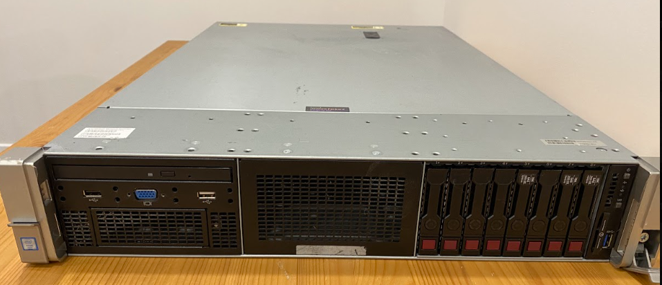
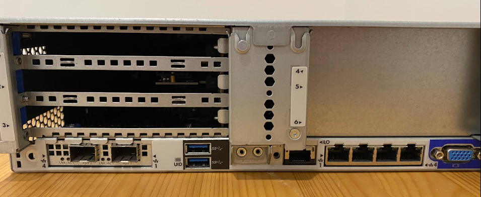
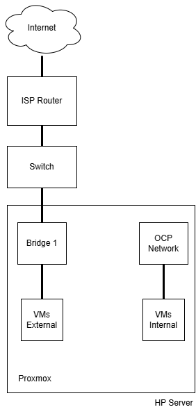

# The hardware guide.
This is an overview of what I have build for my openshift homelab in terms of hardware and network.

## Server - HP DL380 G9
I was luck enough to find this server for only 100 Canadian money on facebook marketplace and unfortunately this will never happen again due to AI race for hardware.

### Specs:
```
CPU: 2x CPU E5-2690 v3 (48 cpus in total)
Memory: 128GB (DDR4-2133Mhz)
Disk:
  - 128G Patriot SSD for OS.
  - 1x 1T Patriot SSD for VM disk.
  - 1x 1T Patriot SSD for VM disk.
  - 1x 1T NVME Intel drive (PCI adaptor) for VM disk.
  - 4x HP HDD RAIDZ for VM disks.
```
**Important note:** Consumer grade SSD like the patriot are not recommended to be used in server and performance wise is very bad. I only used to save some money.




## OS Hypervisor
For this server the hypervisor of choice is Proxmox. This will enable us to create all virtual machines required to our Lab with only one server.

## Network Connections
Very simple and flat network for our setup. We will create a bridge for internal traffic and one for external network traffic.

